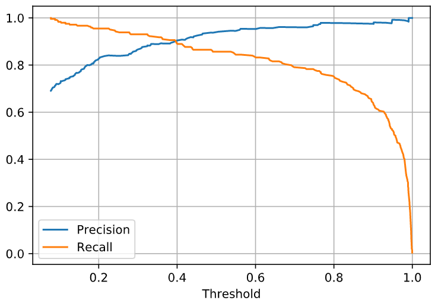
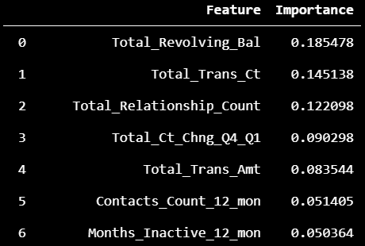
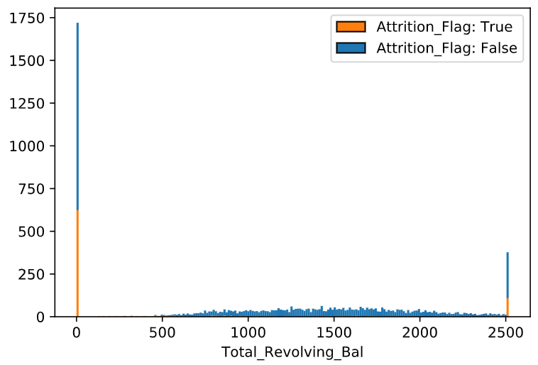
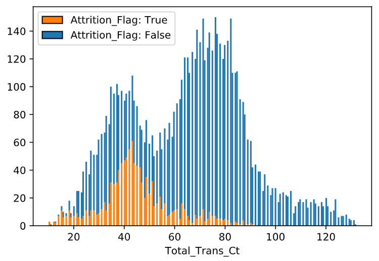

# CreditCardCustomers--XGBoost
An exercise in data preparation and supervised learning from tabular data.

In this project, we will use data from a credit card company to build a binary classifier which predicts which customers will stop using our service (churn). The data can be obtained from [this dataset](https://www.kaggle.com/sakshigoyal7/credit-card-customers) on Kaggle. 

The author of the dataset gives an important note: if our model predicts non-churning customers as churning, it won't hurt the business. However, we do not want to make the opposite error of predicting churning customers as non-churning. So, we allow our model to be more *sensitive* at the price of being less precise. With this in mind, we select a model which will maximize recall, but which still maintains some reasonable level of precision (we choose 80% to be reasonable).

## Model Selection

Gradient boosted trees prove to be very effective at this task. Using the python implementation of the XGBoost algorithm, we are able to define a model which predicts on our test data with 95% recall and 80% precision. 

The XGBoost hyperparameters were tuned using sklearn's RandomizedSearchCV with the parameter grid
```python
{'xgb__learning_rate'    : [0.05, 0.10, 0.15, 0.20, 0.25, 0.30],
 'xgb__max_depth'        : [3, 4, 5, 6, 8, 10, 12, 15],
 'xgb__min_child_weight' : [1, 3, 5, 7],
 'xgb__gamma'            : [0.0, 0.1, 0.2, 0.3, 0.4],
 'xgb__colsample_bytree' : [0.3, 0.4, 0.5, 0.7]}
```

 and the best parameters we could find were:
```python
{'xgb__learning_rate'    : 0.2, 
 'xgb__max_depth'        : 4, 
 'xgb__min_child_weight' : 5, 
 'xgb__gamma'            : 0.2, 
 'xgb__colsample_bytree' : 0.7}.
```

Finally, the decision threshold was manually lowered to 0.20 in order to increase recall at the price of lower precision. This decision was based on examining the precision and recall vs threshold curves.

<p align="center">

</p>

## Conclusions

Our univariate and bivariate analyses together with the feature importance scores tell us which features stand out in terms of predictive power.

<p align="center">

</p>

We can summarize these scores using our own interpretation of them.

1) A customers revolving balance is the most telling; customers with either maximum or minimum revolving balances are significantly more likely to churn, while those in the middle are much less likely. 

<p align="center">

</p>

2) The number of transactions made by the customer reveals a bimodal distribution: one group of customers makes fewer purchases than the other. The customers with fewer purchases are significantly more likely to churn. Those in the second group, not so much.

<p align="center">

</p>

3) Many features echo the evidence of 2), showing that customers who use the service less are more likely to churn. These include: the number of relationships the customer has with us, the total transaction amount, and months inactive.

This indicates that there are two different groups of churning customers: those who are not using their accounts very much and those who are unable to pay off their balance. This passes a sanity test, since the conclusions are not suprising. If someone doesn't use their card very much, it may make sense for them to cancel our service. On the other hand, if a customer cannot pay off their balance, they may want to transfer their balance to another company which offers a lower interest rate. 

One feature that showed surprising importance was the percent of change in the number of purchases made from quarter 4 to quarter 1. Most customers spent less in Q1 than they did in Q4 (mean around 70%), which aligns with the usual increased spending activity around the holidays. But those who spent *significantly* less (mean around 50%) in Q1 were much more likely to churn. One can speculate why this is the case. Perhaps those customers who spent significantly less in Q1 had already found a new service prior to cancelling ours? Many people make big changes at the beginning of a new year and perhaps this is one of those changes. Unfortunately, we don't have any temporal data which gives the date for when they churned. It might be a good idea to communicate this fact with stakeholders to better understand what is happening here. 
